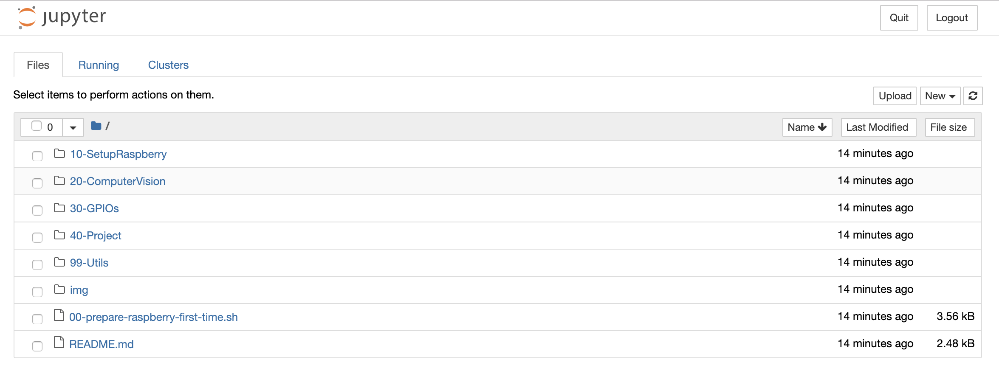

    Rui Martins, rui@martins.pt [Setembro de 2018]

# Instalar Jupyter (Opcional)

`pip install jupyter # python 2`

`pip3 install jupyter # python 3`

`jupyter notebook`

`jupyter notebook --ip 0.0.0.0 --port 8888 # Servir para toda a rede`

`sudo update-alternatives --config x-www-browser # Escolher qual o browser por omissão [OPCIONAL]`

# Instalar OpenCV

## Python 2.x
```
sudo apt-get install -y libopencv-dev python-dev python-opencv python-numpy
python -c "import cv2; print 'OpenCV version: '+cv2.__version__" # Python 2 OpenCV 2
# 3.2.0

sudo pip2 install --upgrade pip
```

## Python 3.x
```
apt list python*opencv*
sudo apt-get install python3-opencv
python3 -c "import cv2; print(cv2.__version__)" # Python 3 OpenCV 3
# 3.2.0

sudo pip3 install --upgrade pip
```


Ignorar os seguintes passos:
```
sudo apt-get install -y libopencv-dev python-dev python-opencv python-numpy

#sudo apt-get install -y libcblas-dev # obsoleted
sudo apt-get install -y libhdf5-dev
sudo apt-get install -y libhdf5-serial-dev
sudo apt-get install -y libatlas-base-dev
sudo apt-get install -y libjasper-dev
sudo apt-get install -y libqtgui4
sudo apt-get install -y libqt4-test

sudo apt-get install -y libjasper1
#sudo apt-get install -y libhdf5-100 # obsoleted
sudo apt-get install -y libhdf5-103

sudo pip3 install opencv-contrib-python # OpenCV 3
# UPDATE: Recentemente não dá para intalar o OpenCV por `sudo pip3 install opencv-python`, nem por `sudo pip3 install opencv-contrib-python`, recebemos sempre o erro "ERROR: No matching distribution found for opencv-python". Temos que compilar para funcionar...
# Saltar para passo "Instalar OpenCV 4 a partir de código fonte"

# Testar se o OpenCV é carregado correctamente:
python -c "import cv2; print 'OpenCV version: '+cv2.__version__" # Python 2 OpenCV 2
python3 -c "import cv2; print('OpenCV version: '+cv2.__version__)" # Python 3 OpenCV 3
```

`sudo pip3 install --upgrade pip`

## Instalar OpenCV 4 a partir de código fonte (DON'T USE, WORK IN PROGRESS...)

sudo apt-get update && sudo apt-get upgrade && sudo rpi-update
sudo vim /etc/dphys-swapfile
# CONF_SWAPSIZE=100 --> CONF_SWAPSIZE=2048
sudo apt-get install -y build-essential cmake pkg-config
sudo apt-get install -y libjpeg-dev libtiff5-dev libjasper-dev libpng12-dev
sudo apt-get install -y libavcodec-dev libavformat-dev libswscale-dev libv4l-dev
sudo apt-get install -y libxvidcore-dev libx264-dev
sudo apt-get install -y libgtk2.0-dev libgtk-3-dev
sudo apt-get install -y libatlas-base-dev gfortran

wget -O opencv.zip https://github.com/opencv/opencv/archive/4.1.1.zip
wget -O opencv_contrib.zip https://github.com/opencv/opencv_contrib/archive/4.1.1.zip
unzip opencv.zip
unzip opencv_contrib.zip

sudo pip3 install numpy

cd ~/opencv-4.1.1/
mkdir build
cd build

cmake -D CMAKE_BUILD_TYPE=RELEASE \
 -D CMAKE_INSTALL_PREFIX=/usr/local \
 -D INSTALL_PYTHON_EXAMPLES=ON \
 -D OPENCV_EXTRA_MODULES_PATH=~/opencv_contrib-4.1.1/modules \
 -D BUILD_EXAMPLES=ON ..

make -j4

sudo make install && sudo ldconfig

sudo reboot

python3 -c "import cv2; print('OpenCV version: '+cv2.__version__)" # Python 3 OpenCV 4


# Instalar outras dependencias

```
sudo apt-get install -y python3-matplotlib
sudo apt-get install -y python3-scipy
sudo pip2 install --upgrade pip
sudo pip3 install --upgrade pip
```

`sudo pip3 install imutils`

`sudo pip3 install jupyter # [optional]`

```
#sudo apt-get install -y libcblas-dev # obsoleted
sudo apt-get install -y libhdf5-dev
sudo apt-get install -y libhdf5-serial-dev
sudo apt-get install -y libatlas-base-dev
sudo apt-get install -y libjasper-dev
sudo apt-get install -y libqtgui4
sudo apt-get install -y libqt4-test

sudo apt-get install -y libjasper1
#sudo apt-get install -y libhdf5-100 # obsoleted
sudo apt-get install -y libhdf5-103
# sudo apt-get --yes --force-yes install libatlas-base-dev
```

# Testar Raspicam

`raspistill -o output.jpg` # Capturar foto

`eog output.jpg` [Se estivermos numa sessão SSH, é preciso ter iniciado a sessão com o parametro `-X` ou seja `ssh -X pi@<ip>`]


# Configurar conda [opcional] 
```
conda install notebook ipykernel
conda install nb_conda # https://stackoverflow.com/questions/37085665/in-which-conda-environment-is-jupyter-executing
conda install --channel=conda-forge nb_conda_kernels # https://github.com/jupyter/jupyter/issues/245

===============

# USAR PYTHON 2.7
conda create -n workshop-rpi-python27 python=2.7
source activate workshop-rpi-python27

pip install opencv-contrib-python

python -c "import cv2; print cv2.__version__"

source deactivate

---------------

# USAR PYTHON 3.7
conda create -n workshop-rpi-python37 python=3.7
source activate workshop-rpi-python37

pip install opencv-contrib-python

python -c "import cv2; print(cv2.__version__)"

source deactivate

===============

conda env list
```

# Hands On

Para executarmos o código do workshop, abre a pasta `~/workshop-rpi-2018`. Caso não exista, faz um clone do repositório com o seguinte comando: `cd ~ && git clone https://github.com/ruimartinsptl/workshop-rpi-2018.git`

Executa um dos seguintes comandos:

* `jupyter notebook` (Para servires o notebook localmente)

* **`jupyter notebook --ip 0.0.0.0 --port 8888` (Para servires o notebook para toda a rede)**

Como pretendemos executar o jupyter no raspberry, e aceder a partir do portatil, deves escolher a segunda opção.

NOTA: Caso pretendas executar localmente e alterar o browser por omissão, executa o seguinte comando
`sudo update-alternatives --config x-www-browser`

No teu portatil deves abir o url: `http://<ip-do-raspberry>:<porta>/?token=<token>`, como por exemplo: `http://192.168.1.100:8888/?token=a8ef9574428bf36ff5f5e477f9ffa556bd10b423da2e2119`



Abre o ficheiro `02-All-Vision.ipynb` dentro da pasta `20-ComputerVision/Vision`

Executa linha a linha...

# Fim da parte 2

## <a name="parte1"></a>1ª parte: Configurar Raspberry PI com WiFi, sem usar monitor e teclado (headless setup).

[Clica para abrires a parte 1](../10-SetupRaspberry)

[Voltar ao Índice](../#indice)


## <a name="parte2"></a>2ª parte: Visão por computador num Raspberry PI com Python e OpenCV

[Clica para abrires a parte 2](../20-ComputerVision)

[Voltar ao Índice](../#indice)

## <a name="parte3"></a>3ª parte: Configuração de GPIOs

[Clica para abrires a parte 3](../30-GPIOs)

[Voltar ao Índice](../#indice)


## <a name="projecto"></a>Mini-projecto

[Clica para abrires a mini projecto](../40-Project)

[Voltar ao Índice](../#indice)
